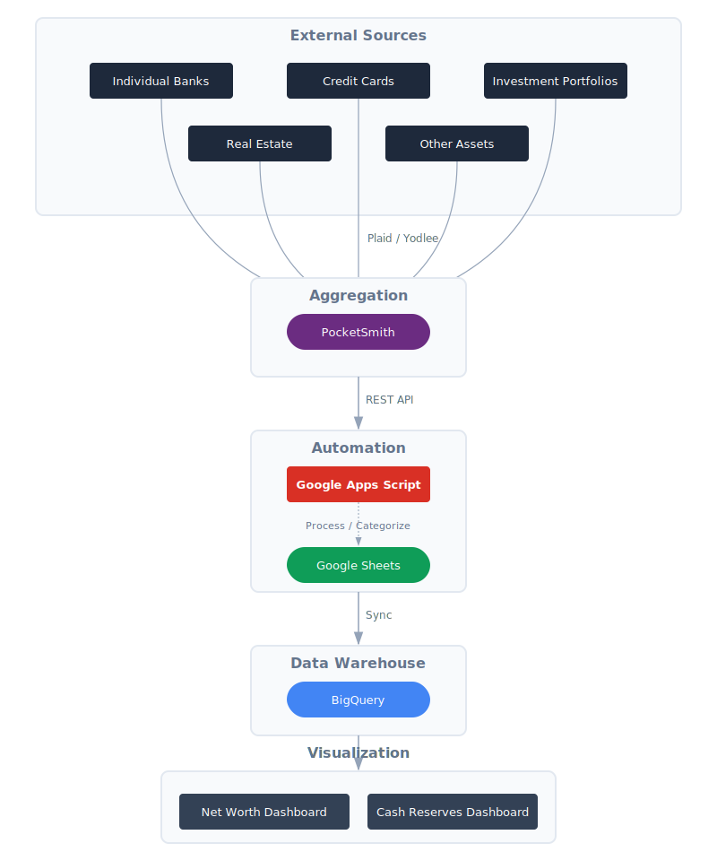

# End-to-End System Architecture

> [!NOTE]
> This repository is for personal use and is maintained for historical tracking and display purposes. **Pull requests are not being accepted at this time.**

This diagram illustrates the flow of financial data from various sources into the final visualization dashboards.

## Data Flow Diagram

<picture>
  <source media="(prefers-color-scheme: dark)" srcset="./Assets/architecture_dark.svg">
  
</picture>

## Flow Description

1.  **Ingestion**: Financial data from banks, credit cards, investment accounts, real estate, and other assets is automatically aggregated by **PocketSmith** via **Plaid / Yodlee**.
2.  **Extraction**: **Google Apps Script** pulls raw transaction and account data from the **PocketSmith** API on a daily schedule.
3.  **Transformation**: The script categorizes accounts (e.g., "Cash", "Investment") and calculates metrics like mandatory spending and financial runway.
4.  **Staging**: The processed data is written to dedicated tabs in a **Google Sheet**.
5.  **Storage**: The Google Sheet is synchronized with **BigQuery**, acting as the central data warehouse.
6.  **Visualization**: **Evidence Studio** dashboards (`Net Worth.md` and `Cash Reserves.md`) query the BigQuery tables using SQL to generate interactive reports and visualizations.

## Live Dashboards

- **Cash Reserves**: [https://www.evidence.studio/org_01KCNDDX3PYPNT5HNPSZQXZPKV/net-worth-dashboard/cash-reserves](https://www.evidence.studio/org_01KCNDDX3PYPNT5HNPSZQXZPKV/net-worth-dashboard/cash-reserves)
- **Net Worth**: [https://www.evidence.studio/org_01KCNDDX3PYPNT5HNPSZQXZPKV/net-worth-dashboard/net-worth](https://www.evidence.studio/org_01KCNDDX3PYPNT5HNPSZQXZPKV/net-worth-dashboard/net-worth)

## Configuration (GCP Migration)

The system has been migrated to **Google Cloud Platform (Cloud Run & BigQuery)**. Configuration is now managed via **Google Cloud Secret Manager**.

For detailed instructions on how to set up the `config_json` secret and other environment variables, please see:
[GCP CONFIG.md](file:///Users/jared/GitHub/atlas-cannonball/GCP/CONFIG.md)

### Legacy Apps Script Properties
| Property | Description |
| :--- | :--- |
| `POCKETSMITH_API_KEY` | Your PocketSmith Developer Key |
| `POCKETSMITH_USER_ID` | Your PocketSmith User ID |
| ... | *See GCP CONFIG.md for full list* |

## Contributing

This project is a personal financial tracking system tailored to a specific workflow and set of tools. As such, it is not currently open for external contributions or pull requests. You are welcome to fork the repository for your own personal use, but please be aware that the code is provided "as-is" without support or maintenance guarantees.
