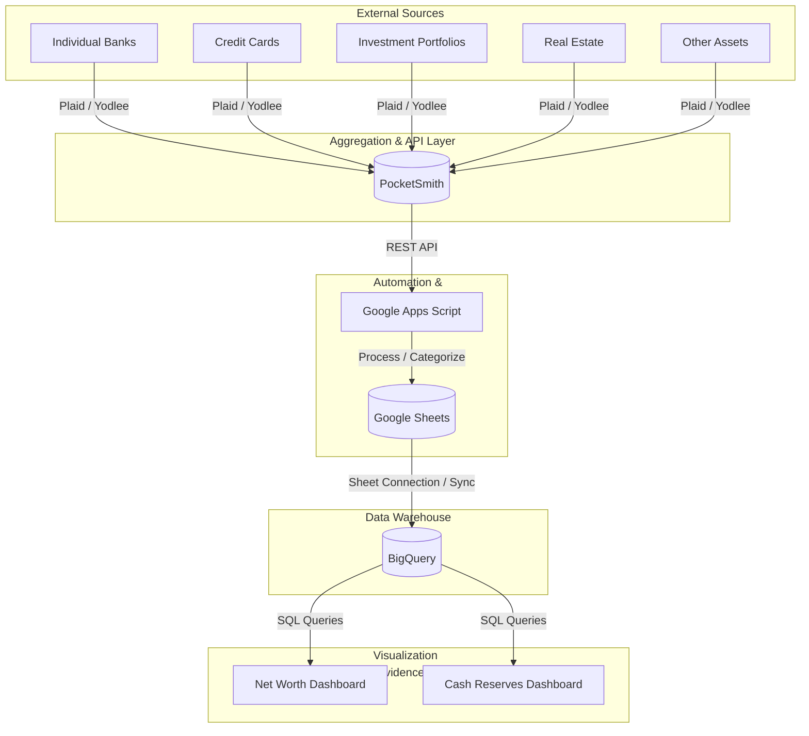

# End-to-End System Architecture

This diagram illustrates the flow of financial data from various sources into the final visualization dashboards.

## Data Flow Diagram

## Flow Description

1.  **Ingestion**: Financial data from banks, credit cards, investment accounts, real estate, and other assets is automatically aggregated by **PocketSmith** via **Plaid / Yodlee**.
2.  **Extraction**: **Google Apps Script** pulls raw transaction and account data from the **PocketSmith** API on a daily schedule.
3.  **Transformation**: The script categorizes accounts (e.g., "Cash", "Investment") and calculates metrics like mandatory spending and financial runway.
4.  **Staging**: The processed data is written to dedicated tabs in a **Google Sheet**.
5.  **Storage**: The Google Sheet is synchronized with **BigQuery**, acting as the central data warehouse.
6.  **Visualization**: **Evidence Studio** dashboards (`Net Worth.md` and `Cash Reserves.md`) query the BigQuery tables using SQL to generate interactive reports and visualizations.
